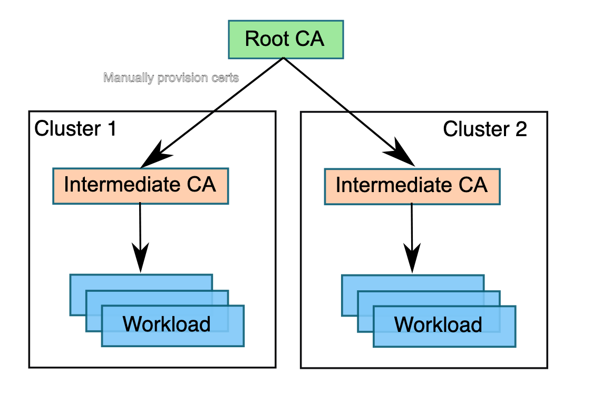

# Configure Vault PKI Engines for Istio CA

## Why we need CA for Istio?

[`A multicluster service mesh deployment requires that you establish trust between all clusters in the mesh.`](https://istio.io/latest/docs/setup/install/multicluster/before-you-begin/#configure-trust)

Since this demo demonstrates a [Multi-Primary on different networks](https://istio.io/latest/docs/setup/install/multicluster/multi-primary_multi-network/), Istio requires the use of a cacert that was generated from the same root CA across all clusters.


(Ref: [Recommended CA hierarchy in a mesh containing two clusters](https://istio.io/latest/docs/tasks/security/cert-management/plugin-ca-cert/))

## Why we need Vault as PKI engine?

Using Vault as the PKI engine for Istio CA provides several benefits:

1. Root CA and Intermediate CA: Vault allows you to configure both the root CA and intermediate CA for Istio. This enables you to have a hierarchical CA structure where the intermediate CA is signed by the root CA.

2. Centralized Certificate Management: By integrating Vault with cert-manager and Istio CSR (Certificate Signing Request), you can easily manage and publish certificates for Istio CA across the cluster. This simplifies the process of certificate management and ensures consistent trust across all clusters in the multicluster service mesh deployment.

3. Enhanced Security: Vault provides robust security features, such as encryption, access control policies, and auditing capabilities. By leveraging Vault as the PKI engine, you can enhance the security of your Istio CA infrastructure.

## Configuring Vault

Refs:

- <https://developer.hashicorp.com/vault/tutorials/secrets-management/pki-engine>
- <https://medium.com/@espinaladrinaldi/istio-multicluster-with-istio-csr-cert-manager-vault-pki-66c2d58f1c7f>

### Overview and Convention

- we are going to enable and configure 2 Vault PKI engine,
  - Root CA PKI Engine: `pki_root_ca`
  - Intermediate CA PKI Engine: `pki_istio_int`

  > we configure single intermediate CA that issue the CA for istio for each cluster in this demo.
  >
  > but, you can creates intermediate CA per cluster for additional layer of isolation between clusters

- configuring istio intermediate CA to be used in `cert-manager/istio-csr`
  - please be aware of `allowed_uri_sans="spiffe://*"` for role creation

- creating AppRole, AppRole Secret ID, and ACL policy for configuring cert-manager Vault issuer auth method

### Configure Root CA PKI Engine

Enable PKI secret engine in the path `pki_root_ca`.

```bash
vault secrets enable -path=pki_root_ca pki
```

Tune the secret engine to issue certificates with a maximum time-to-live(TTL) of 87600 hours (10 years).

```bash
vault secrets tune -max-lease-ttl=87600h pki_root_ca
```

Generate the root CA and save certificate in the file `ca_cert.crt`. the cert file will be used for signing intermediate cert later.

```bash
vault write -field=certificate pki_root_ca/root/generate/internal \
  common_name="Root CA" \
  organization="MeowHQ" \
  issuer_name="meowhq-root-ca" \
  key_bits=4096 \
  ttl=87600h > ca_cert.crt
```

Configure the CA and CRL URLs.

```bash
vault write pki_root_ca/config/urls \
  issuing_certificates="https://vault.lab.meowhq.dev/v1/pki_root_ca/ca" \
  crl_distribution_points="https://vault.lab.meowhq.dev/v1/pki_root_ca/crl"
```

Create a role for the root CA.

```bash
vault write pki_root_ca/roles/issuer \
  allow_any_name=true \
  key_type=any \
  max_ttl=7200h
```

> I changed the order between CA/CRL URL and role creation to avoid the warning message in the Vault.

### Configure Intermediate CA PKI Engine as Istio CA

Enable PKI engine at the `pki_istio_int` path.

```bash
vault secrets enable -path=pki_istio_int pki
```

Tune the `pki_istio_int` secrets engine to issue certificates with a maximum time-to-live (TTL) of 43800 hours (5 yrs).

```bash
vault secrets tune -max-lease-ttl=43800h pki_istio_int
```

Generate an intermediate and save the CSR as `pki_intermediate.csr`.

```bash
vault write -format=json pki_istio_int/intermediate/generate/internal \
  common_name="Istio Intermediate CA" \
  organization="MeowHQ" \
  issuer_name="istio-intermediate" \
  key_bits=4096 ttl=87600h \
| jq -r '.data.csr' > pki_intermediate.csr
```

Sign the intermediate certificate with the root CA private key, and save the generated certificate as `signed_certificate.pem`.

```bash
vault write -format=json \
  pki_root_ca/root/sign-intermediate \
  issuer_ref="meowhq-root-ca" \
  csr=@pki_intermediate.csr \
  format=pem ttl="43800h" key_type=any \
| jq -r '.data.certificate' > signed_certificate.pem
```

Create chained certificate with root ca cert.

```bash
cat signed_certificate.pem > signed_certificate.chain.pem
cat ca_cert.crt >> signed_certificate.chain.pem
```

Once the CSR is signed and the root CA returns a certificate, it can be imported back into Vault.

```bash
vault write pki_istio_int/intermediate/set-signed \
  certificate=@signed_certificate.chain.pem
```

Configure the CA and CRL URLs.

```bash
vault write pki_istio_int/config/urls \
  issuing_certificates="https://vault.lab.meowhq.dev/v1/pki_istio_int/ca" \
  crl_distribution_points="https://vault.lab.meowhq.dev/v1/pki_istio_int/crl"
```

Create a role for the istio intermediate CA.

```bash
vault write pki_istio_int/roles/issuer \
  allowed_domains="istio-ca" \
  allow_any_name=true \
  enforce_hostnames=false \
  require_cn=false \
  allowed_uri_sans="spiffe://*" \
  max_ttl=7200h
```

### Configure AppRole

Create a policy named `istio-int-ca-policy` that allows `create` and `update` actions on the `pki_istio_int/sign/issuer` path.

> `create` capability may not required

```bash
vault policy write istio-int-ca-policy - <<EOF
path "pki_istio_int/sign/issuer" {
  capabilities = ["create", "update"]
}
EOF
```

enable AppRole auth in the path `istio-int-ca-role`.

```bash
vault auth enable approle -path=istio-int-ca-role
```

create an AppRole named `istio-int-ca-issuer` with the token policy `istio-int-ca-policy`.

```bash
vault write auth/istio-int-ca-role/role/istio-int-ca-issuer \
  token_policies="istio-int-ca-policy"
```

finally, create secret id and store it somewhere to use it later.

```bash
vault write -f auth/istio-int-ca-role/role/istio-int-ca-issuer/secret-id
```
