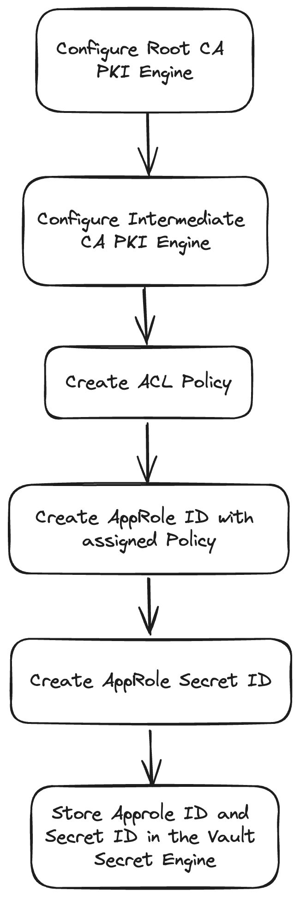

# Terraform for Vault PKI

Terraform implementation of [Configure Vault PKI Engines for Istio CA](../docs/configure-vault-pki-engines.md)

but, the Terraform is provisioning PKI engine in the path,

- Root CA PKI Engine: `pki/meowhq/istio_root_ca` (`pki_root_ca` in the manual instruction)
- Intermediate CA PKI Engine: `pki/meowhq/istio_int_ca` (`pki_istio_int` in the manual instruction)

## Workflow



## Apply

export environment variable for Vault server.

```bash
export VAULT_ADDR=<your-vault>
export VAULT_TOKEN=<your-token>
```

init:

```bash
terraform init
```

plan and apply:

```bash
terraform plan
terraform apply
```
